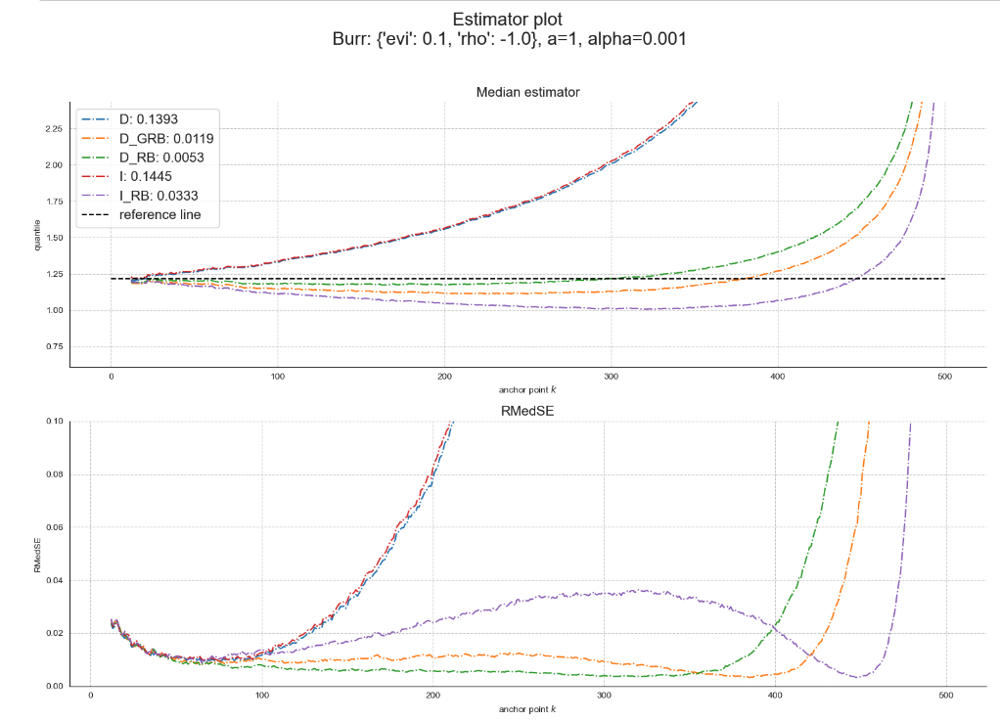
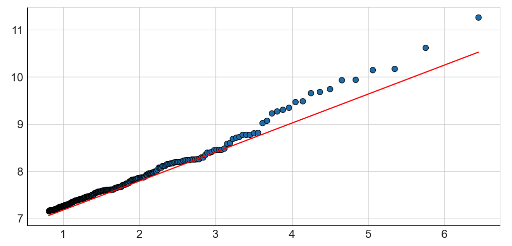
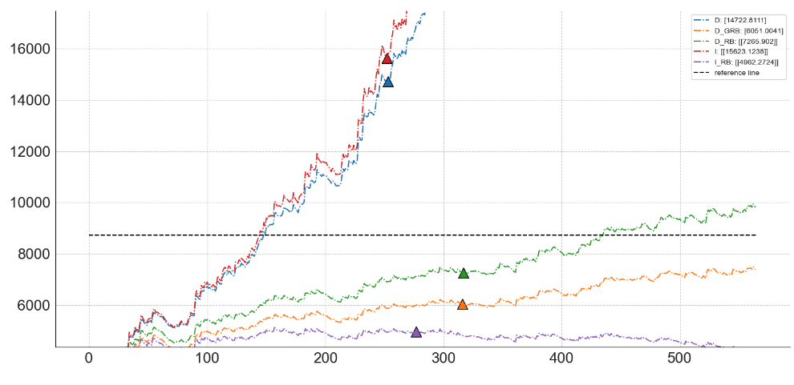

# bctm-extreme

# Reduced-bias estimation of the extreme conditional tail  expectation for Box-Cox transforms of heavy-tailed distributions, 2023
Implementation of the paper ["Reduced-bias estimation of the extreme conditional tail  expectation for Box-Cox transforms of heavy-tailed distributions"](https://hal.inria.fr/hal-03266676v3/document),
by [Michaël Allouche](www.linkedin.com/in/michaël-allouche-3049b7108),  [Jonathan El Methni](https://scholar.google.fr/citations?user=JjjH8N8AAAAJ&hl=fr) and [Stéphane Girard](http://mistis.inrialpes.fr/people/girard/).

The repo contains the codes for comparing 5 estimators of the extreme Box-Cox Tail Moments (BCTM) on both simulated and real-data.

## Abstract
Conditional tail expectation (CTE) is a coherent risk measure defined as the mean of the loss distribution above a high quantile. 
The existence of the CTE as well as the asymptotic properties of associated estimators however require integrability conditions that may be violated 
when dealing with heavy-tailed distributions. We introduce Box-Cox transforms of the CTE that have two benefits. First, they alleviate
these theoretical issues.
Second, they enable to recover a number of risk measures such as conditional tail expectation, expected shortfall, conditional value-at-risk or conditional tail variance.
The construction of dedicated estimators is based on the investigation of the asymptotic relationship between Box-Cox transforms of the CTE and quantiles at extreme probability levels, as well as on an extrapolation formula established in the heavy-tailed context. We quantify and estimate the bias induced by the use of these approximations and then introduce reduced-bias estimators whose asymptotic properties are rigorously shown. Their finite-sample properties are assessed on a simulation study and illustrated on real data, highlighting the practical interest of both the bias reduction and the Box-Cox transform


## Dependencies
Clone the repo

```
git clone https://github.com/michael-allouche/bctm-extreme.git
cd bctm-extreme
```


Install the requirements for each software version used in this repo
- Python 3.10.1

_via pip_

`pip install -r requirements.txt`

_or via conda_

```
conda create --name bctm python=3.10
conda activate bctm
conda install --file requirements.txt
```

- R 4.1.2

`install.packages("evt0")`

## Usage

### Simulated data
Seven heavy-tailed distributions are implemented in `./extreme/distribution.py`:

**Pareto, Burr, Fréchet, Fisher, GPD, Inverse Gamma, Student**.

In `run_sim_estimators.py`, one can update the hyperparameters with the desired parametrization. 
```
LIST_EVI = [0.1, 0.3, 0.5, 0.7, 0.9]  # extreme value indices
LIST_SOP = [-1, -0.75, -0.5, -0.25]  # second order parameters
N_DATA = 500
N_REPLICATIONS = 500
RISK_LEVEL = 1 / (2 * N_DATA)
A = 1  # power level
ZETA = 0.02  # consider the anchor points $k_n\in\{1+[\zeta n], \dots, n-1 \}$ with $\zeta\in[0,1)$
LIST_DISTRIBUTIONS = ["burr", "gpd", "student", "pareto", "fisher", "frechet", "invgamma"]
```

Next, run `run_sim_estimators.py`. Once the run is finished, all the metrics for each estimator are saved in the folder `./ckpt`.

In the notebook, you can display a result table. For example

```
from extreme.estimators import sim_estimators 
sim_estimators(n_replications=500, n_data=500, risk_level=1/1000, 
               distribution="burr", params={"evi":0.1, "rho": -1.}, a=1, zeta=0.02)
```
```
		D		D_GRB		D_RB		I		I_RB
RMedSE		0.139275	0.011895	0.005251	0.144527	0.033335
```
You can also plot the bias and RMedSE

```
from extreme import visualization as xviz
xviz.xbctm_evt_mse_plot(distribution="burr", params={"evi":0.1, "rho":-1.}, 
                 n_data=500, zeta=0.02, a=1, risk_level=1/(2*500),
                        n_replications=500, criteria="mad", metric="median")
```



### Real data
We consider here fire insurance claims of a Norwegian insurance company for the year 1990 data set in `./dataset/norwegian90.csv`
It consists of n=628 claims (in 1000 NOK). Below the log quantile-quantile plot of the data with an estimated Hill estimator of 0.62 represented by the red line:



Consider a train-test split:

- Our first objective is to compute the BCTM with power level a ∈ {1/2, 1} at the extreme risk level $p_n = 1/\lceil n\xi\rceil$
on the training set using the five above competitors and to compare the results with the empirical estimation.
```
  xviz.xes_real_bias_plot(a=1, xi=0.9)
  ```



- Our second goal is to deduce from the previous results of the BCTM with a=1/2 some estimates of the CTE at the extreme level $p_n=1/\lceil n\xi\rceil$
```
xviz.xes_real_cte_half(xi=0.9)
```


            EMP    D	D_GRB	D_RB	I	I_RB
    CTE     8732  16606     6508    7852    17056   5307


## Citing
@unpublished{allouche:hal-04243953,
  TITLE = {{Reduced-bias estimation of the extreme conditional tail  expectation for Box-Cox transforms of heavy-tailed distributions}},
  AUTHOR = {Allouche, Micha{\"e}l and El Methni, Jonathan and Girard, St{\'e}phane},
  NOTE = {working paper or preprint},
  YEAR = {2023},
  PDF = {https://inria.hal.science/hal-04243953/file/boxcox-CTE.pdf}
}